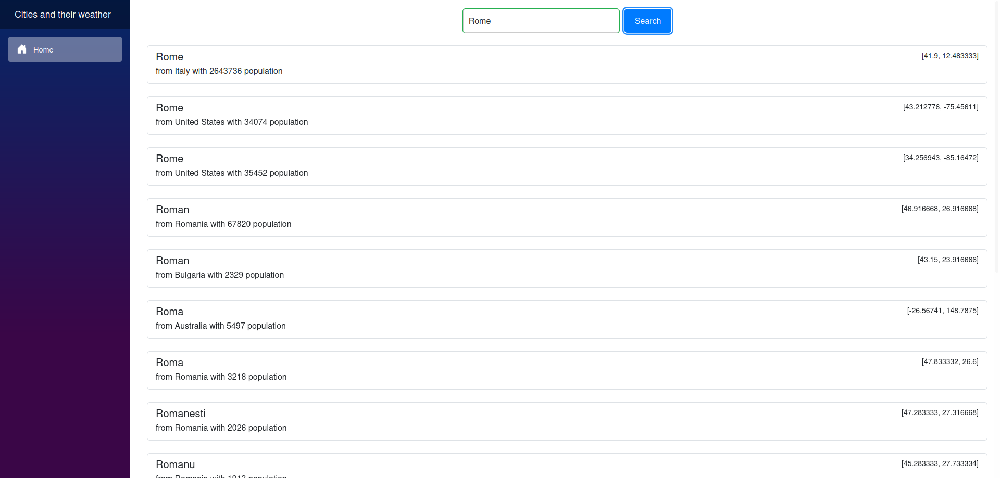
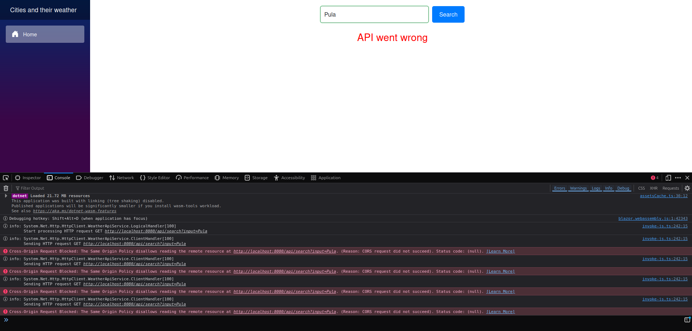

**Cities Search**

    
    
    
    
    

 

Just a simple weather app project which has the purpose of applying searches in a vector database using embeddings.

The project was created with python and rust on the backend and the frontend is created in blazor

First the database collection is created and the vector is created by the city. 

The dataset was taken from HuggingFace and contains the city, country, population of it's global coordinates

Here is the dataset link: https://huggingface.co/datasets/WorkWithData/cities

When the python small API for embeddings is running, it prepares first the data and populates the colelction in the qdrant database. The model used for embedding in my demo is **all-MiniLM-L6-v2** 

Then when a search is made by the user, the rust application requests the embedding for that input to the python application using an api key and after that it checks the qdrant db for the results. Results are put based on the confidence score.

Below there are 2 examples of searches: 

There is also a circuit breaker implemented on frontend using **Polly** library in case the api is not available. An example is here: 

After pressing a city, the user is redirected to the weather page which is taken from an external API (here is an example: https://goweather.herokuapp.com/weather/Rome)

